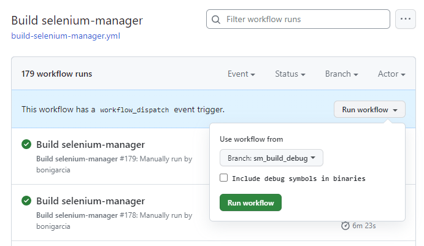

### Support for Firefox ESR
Selenium Manager 0.4.15 includes support for Firefox Extended Support Release (ESR). This way, Firefox ESR can be automatically managed with Selenium using the label `esr` in the browser version. Bindings languages set this browser version (like other accepted labels for browser versions, such as `stable,` `beta,` `dev,` `canary,` and `nightly`) using a browser option called [browserVersion](https://www.selenium.dev/documentation/webdriver/drivers/options/#browserversion).

### Support for Edge WebView2
Selenium Manager 0.4.15 allows automated driver management for [Microsoft Edge WebView2](https://developer.microsoft.com/microsoft-edge/webview2). WebView2 is a component that enables embedding web technologies (HTML, CSS, and JavaScript) in native apps, using Microsoft Edge as the rendering engine to display web content. At the time of this writing, WebView2 is available in Windows.

This way, Selenium Manager allows detecting WebView2 in Windows machines and resolving the proper msedgedriver binary for it. Internally, Selenium Manager uses the browser name `webview2` to handle WebView2, detecting its version based on [registry queries](https://learn.microsoft.com/en-us/microsoft-edge/webview2/concepts/distribution#detect-if-a-suitable-webview2-runtime-is-already-installed). In the bindings, WebView2 is enabled through a browser option called `useWebView`. 

### Support for mirror repositories
Selenium Manager 0.4.15 includes a couple of new arguments in Selenium Manager for specifying custom URLs for drivers and browsers (instead of the default ones, such as [chromedriver](https://chromedriver.storage.googleapis.com/), [Chrome for Testing](https://googlechromelabs.github.io/chrome-for-testing/), etc.). These arguments are:

- `--driver-mirror-url`: Mirror URL for driver repositories.
- `--browser-mirror-url`: Mirror URL for browser repositories.

As usual, these values can be configured using the config file or environment variable (e.g., `SE_DRIVER_MIRROR_URL` or `SE_BROWSER_MIRROR_URL`). Moreover, there are browser and driver-specific configuration keys, i.e. `chrome-mirror-url`, `firefox-mirror-url`, `edge-mirror-url`, etc. (in the configuration file), and `SE_CHROME_MIRROR_URL`, `SE_FIREFOX_MIRROR_URL`, `SE_EDGE_MIRROR_URL`, etc. (as environment variables).

Here is an example of this feature calling Selenium Manager from the shell:

```
./selenium-manager --debug --browser chrome --browser-version 100 --avoid-browser-download --driver-mirror-url=https://registry.npmmirror.com/-/binary/chromedriver/
DEBUG   chromedriver not found in PATH
DEBUG   chrome detected at C:\Program Files\Google\Chrome\Application\chrome.exe
DEBUG   Running command: wmic datafile where name='C:\\Program Files\\Google\\Chrome\\Application\\chrome.exe' get Version /value
DEBUG   Output: "\r\r\n\r\r\nVersion=117.0.5938.150\r\r\n\r\r\n\r\r\n\r"
DEBUG   Detected browser: chrome 117.0.5938.150
DEBUG   Discovered chrome version (117) different to specified browser version (100)
DEBUG   Required driver: chromedriver 100.0.4896.60
DEBUG   Downloading chromedriver 100.0.4896.60 from https://registry.npmmirror.com/-/binary/chromedriver/100.0.4896.60/chromedriver_win32.zip
INFO    Driver path: C:\Users\boni\.cache\selenium\chromedriver\win64\100.0.4896.60\chromedriver.exe
INFO    Browser path: C:\Program Files\Google\Chrome\Application\chrome.exe
```

### Debug release
To troubleshoot Selenium Manager in complex error cases, it is interesting to capture the backtrace. But to do that, the Selenium Manager binaries must be created with the debug symbols. Since the resulting binaries with debug symbols are much larger than the default release artifacts, we generate them on demand using a custom [workflow in GitHub Actions](https://github.com/SeleniumHQ/selenium/actions/workflows/build-selenium-manager.yml). This way, we have included a checkbox in the workflow for triggering the Selenium Manager build. When this checkbox is enabled when building Selenium Manager, the debug symbols will be added to the resulting binaries (for Windows, Linux, and macOS). All in all, these binaries will be used on demand to troubleshoot complicated problems.



### Selenium Manager in cache (only for Java bindings)
As of version 4.15.0 of the Selenium Java bindings, the Selenium Manager binary is extracted and copied to the cache folder. For instance, the Selenium Manager binary shipped with Selenium 4.15.0 is stored in the folder `~/.cache/selenium/manager/0.4.15`). This feature will allow direct manipulation of Selenium Manager as a CLI tool, for instance, for troubleshooting. This feature is only available for Java bindings since Java is the only language that does not have direct access to the Selenium Manager binaries (since they are released compressed into the JAR files of the `selenium-java` artifacts).

### Next steps
Look at [Selenium Manager documentation](https://www.selenium.dev/documentation/selenium_manager/) for a detailed description of its features. Also, you can trace the status of the development activities in the [Selenium Manager project dashboard](https://github.com/orgs/SeleniumHQ/projects/5).
