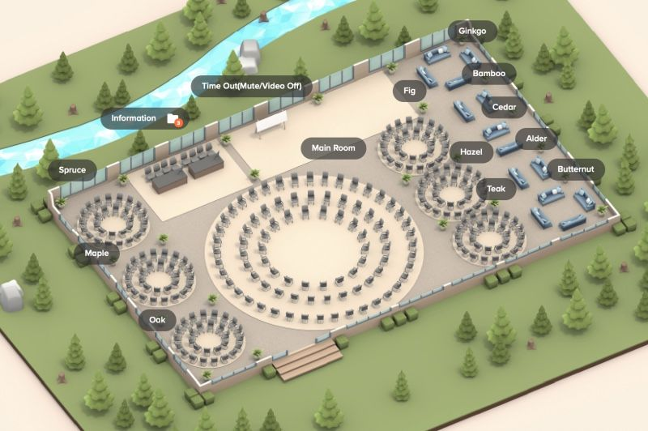

In less than two weeks, Selenium project is holding space for free and online community meetup, the inaugural Selenium Open Space Conference. Open space conferences are ones where everyone is a speaker, and we co-create our agenda for conversations, questions or answers, workshops, sharing and learning.

We start our 24 hour event at time of 19 years from the tracked Selenium release announcement. We split the day into four segments to facilitate the global community. We set up an [event site](https://selenium.dev/sosc), and a mechanism to enroll: by pull request or issue to the [site in github](https://github.com/SeleniumHQ/sosc).

With enrollment, you can already tell if you have a topic in mind you would like to host, and see some (not all!) of the sessions people have in mind for the day.

To run the event, we set up Welo and Miro. Our space has 11 track rooms that each fit up to 150 people regardless of appearance, and we build our agenda on Miro during marketplace of ideas, one for each four time segments.

Welcome from the organizers, would be lovely to see you join us all.